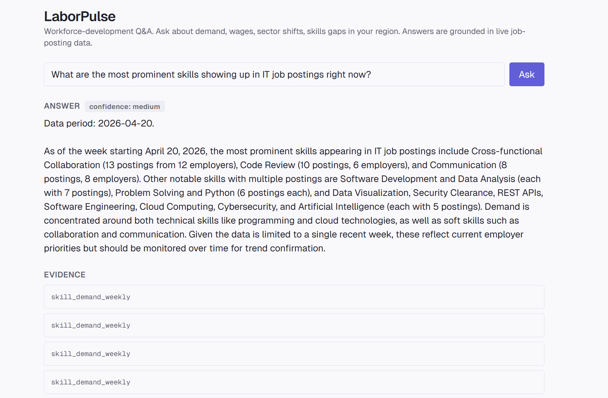
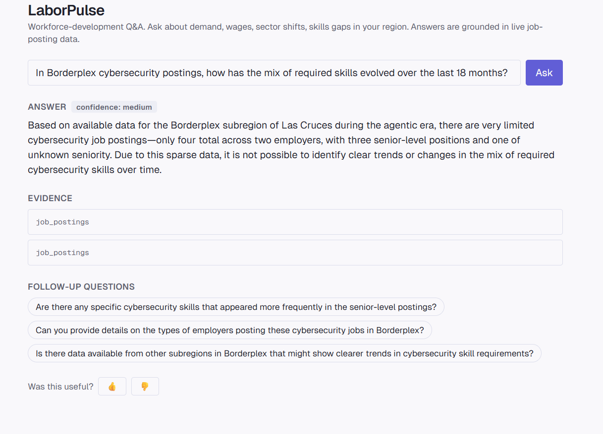
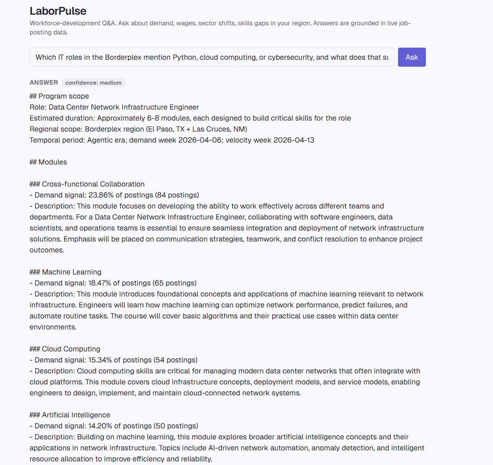
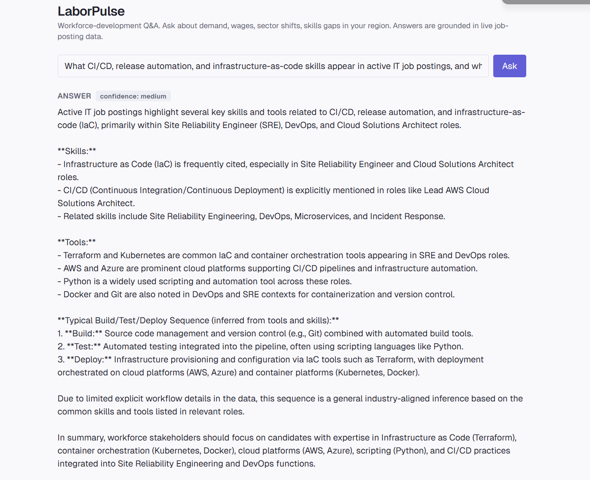
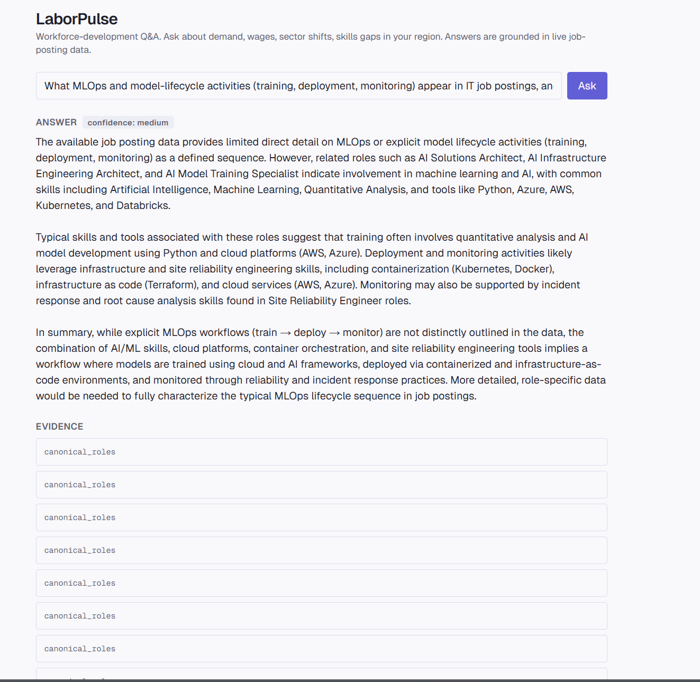

# LaborPulse Demo Script — Pair D

## 1. Introduction (5 min)

Today we are demoing LaborPulse, a workforce-development Q&A assistant grounded in live Borderplex job-posting data.

The goal is to show how a workforce-development director can ask practical questions and get answers that are specific, evidence-backed, and useful for training and program decisions.

LaborPulse takes a natural-language question, routes it to the correct labor-market data path, retrieves evidence, and generates an answer with confidence labels and follow-up questions.

If the live system fails during the demo, we will switch to the screenshots captured during rehearsal.

---

## 2. Live Demo (15 min)

### Question 1 — Current IT Skill Demand

**Prompt**

> What are the most prominent skills showing up in IT job postings right now?

**What to say**

This opens the demo with a broad snapshot of current IT skill demand. The system identifies the most common skills appearing in postings and grounds the answer in `skill_demand_weekly`.

**Key takeaway**

The answer shows that employer demand is not only technical. Skills like cross-functional collaboration, code review, communication, software development, data analysis, and Python all appear as important signals.

**Screenshot**

---

### Question 2 — Cybersecurity Trend Backup

**Prompt**

> In Borderplex cybersecurity postings, how has the mix of required skills evolved over the last 18 months?

**What to say**

This question tests whether LaborPulse can answer a focused cybersecurity trend question. In our local run, the system surfaced limited available data and gave a confidence-aware answer instead of inventing a stronger trend.

**Key takeaway**

This is useful as a transparency moment. When the data is thin, the system says so.

**Screenshot**

---

### Question 3 — Python, Cloud, and Cybersecurity Roles

**Prompt**

> Which IT roles in the Borderplex mention Python, cloud computing, or cybersecurity, and what does that suggest for training priorities?

**What to say**

This question connects role and skill signals to training decisions. The system turns skill demand into curriculum-style recommendations.

**Key takeaway**

LaborPulse is not just listing facts. It helps translate job-posting signals into decisions a workforce-development team can act on.

**Screenshot**

---

### Question 4 — CI/CD, Release Automation, and Infrastructure-as-Code

**Prompt**

> What CI/CD, release automation, and infrastructure-as-code skills appear in active IT job postings, and what does the typical build / test / deploy sequence look like?

**What to say**

This question demonstrates a workflow-oriented answer. The system identifies tools and skills connected to DevOps work, including Terraform, Kubernetes, AWS, Azure, Python, Docker, Git, CI/CD, and infrastructure as code.

**Key takeaway**

The answer is useful because it explains how skills fit into a real build, test, and deploy workflow. It also makes clear that some workflow details are inferred from tools and skills rather than directly stated in postings.

**Screenshot**

---

### Question 5 — MLOps and Model Lifecycle

**Prompt**

> What MLOps and model-lifecycle activities (training, deployment, monitoring) appear in IT job postings, and what does the typical training → deploy → monitor sequence look like?

**What to say**

This question shows the AI/ML infrastructure side of LaborPulse. The system surfaces roles and tools connected to model lifecycle work, including AI Solutions Architect, AI Infrastructure Engineering Architect, Python, Kubernetes, Azure, AWS, and Databricks.

**Key takeaway**

The answer is honest that job postings do not fully describe the workflow sequence. Still, they show which roles and tools are connected to MLOps work.

**Screenshot**

---

## 3. Known Local Issue — Curriculum Calibration Questions

The IMP-034 guide expected two curriculum questions to demonstrate calibration:

1. AI agent developer training program
2. Cybersecurity training program

On my local run, both returned low-confidence insufficient-data responses instead of the expected locked answers.

Those prompts were:

> What should an AI agent developer training program cover given current postings — which LLM frameworks, orchestration patterns, and integration skills are in demand?

> What should a cybersecurity training program cover given current job postings?

Message for the team:

> Q1, Q4, and Q5 worked locally. Q2 and Q3 both returned low-confidence insufficient-data on the curriculum path, even after switching `PYTHON_DATABASE_URL` to the Azure Postgres URL. I captured mismatch screenshots and two backup questions.

For the demo backup package, Question 2 and Question 3 above are replacement screenshots from the local run, not the locked IMP-034 curriculum pair.

---

## 4. Metrics Review (5 min)

The demo should emphasize answer quality, not just system architecture.

Quality signals to point out:

- Confidence labels are visible.
- Answers cite underlying data sources.
- Some answers provide specific skills, tools, roles, counts, and time periods.
- The system can be transparent when data is limited.
- The evidence display still needs UI polish because repeated evidence rows can be noisy.

Current local results:

- Question 1 produced a useful medium-confidence skill-demand answer.
- Question 2 showed limited cybersecurity trend data honestly.
- Question 3 produced training-priority guidance from Python, cloud, and cybersecurity skill signals.
- Question 4 produced a useful medium-confidence CI/CD workflow answer.
- Question 5 produced a useful medium-confidence MLOps workflow answer.
- The locked curriculum calibration pair did not reproduce locally and should be flagged.

---

## 5. Closing (5 min)

LaborPulse is strongest when it helps workforce-development teams move from raw job postings to decisions.

The demo shows that the system can:

- answer natural-language labor-market questions
- ground answers in job-posting evidence
- surface confidence levels
- connect skills and tools to training priorities
- avoid overstating conclusions when data is thin

Next improvements:

- fix or align the curriculum data path so the locked calibration questions reproduce consistently
- improve frontend evidence display
- strengthen role-family grouping
- make low-confidence answers easier to explain in stakeholder demos

If the live system fails, transition line:

> The live system is not cooperating right now, so let me show the answer we captured during rehearsal.
